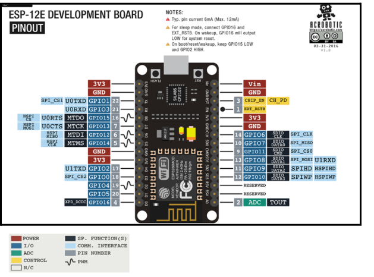

# Libreria RaulDisp

## Instalacion

## Componentes de la libreria
### Sensores
- **Sensor DHT22:** Sensor para el control de la humedad y temperatura hambiente. [ver](./doc/SensorDHT22.md)
- **Sensor LDR:** Sensor para detectar la cantidad de luz. [ver](./doc/SensorLDR.md)
- **Sensor YL69:** Sensor para el control de la humedad de la tierra. [ver](./doc/SensorYL69.md)
- **Sensor HC-SR04:** Sensor que nos indica la distancia de los objetos. [ver](./doc/sensorHCSR04.md)

### Otros componentes
- **Bomba de agua:** Componente para controlar un rele que activara una bomba de agua. [ver](./doc/Rele.md) 
Ademas podremos usar el rele para otros dispositivos. [ver](./doc/ComponentesBasicos.md)
- **Pantalla:** Es una pantalla oled donde se puede ir escribiendo algo de infromacion, el tamaño no es muy grande. [ver](./doc/Pantalla.md)
- **Flotador:** Este componente calcula el nivel de agua en un deposito. [ver](./doc/NivelAgua.md)

### Utilidades Web
- **Crear un punto de acceso:** Componente que crea una red interna para el tratamiento de la informacion. [ver](./doc/WebServer.md)
- **Lot:** Para mas informacion [ver](./doc/UnPocoDeLot.md) 

### Utilidades dispositivo
- **Ahorro de energia:** Podemos hacer que el dispositivo se apague o apague algunos de sus componentes para asi ahorrar energia. [ver](./doc/AhorroEnergia.md)

## Mas sobre el modulo NodeMCU
Más información de las conexiones de la placa en esta [página](https://programarfacil.com/podcast/nodemcu-tutorial-paso-a-paso/)  
**Este es un esquema basico de las conexiones de la placa**

  

