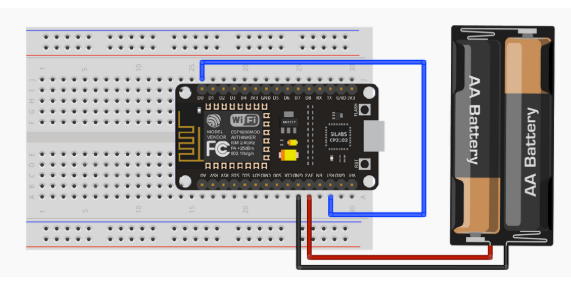

# Ahorro de energia
Existen diferentes modos de ahorro de energía para que no se gaste la bateria muy rapido. 
Este es un listado de los tiempos:
| Item | Mode-Sleep | Light-Sleep | Deep-Sleep |
|----------|-----------|-----------|-----------|
| Wi-Fi  | OFF   | OFF   | OFF |
| System clock  | ON   | OFF   | OFF |
| RTC  | ON   | ON   | ON |
| CPU  | ON   | Pending   | OFF |
| Substrate current | 15 mA   | 0.4mA   | ~20uA |
| Average: DTM = 1 | 16.2 mA   | 1.8mA   | |
| Average: DTM = 3 | 15.4 mA   | 0.9mA   | |
| Average: DTM = 10| 15.2 mA   | 0.55mA   | |

## Deep-Sleep
Como podrá ver a continuación, es el modo que genera mayor ahorro, pero a costa de dejar la placa en suspenso. La única parte de la placa que funciona durante este modo es reloj en tiempo real, para poder reiniciarla cuando haya finalizado el tiempo de reposo. 
La función que usaremos sera ESP.deepSleep (tiempo_en_us, modo_reinicio)
- tiempo_en_us (uint32_t): tiempo en microsegundos que debe estar el microprocesador en suspenso.
- modo_reinicio: indica cómo se debe proceder cuando se reinicia el microprocesador con la calibración de la señal de radio para la WiFi. Existen cuatro posibilidades:
    - WAKE_RF_DEFAULT: cuando se reinicia el microprocesador, únicamente se calibra la señal de radio si el chequeo de error (init data byte 108>0).
    - SLEEP_TIME, WAKE_RFCAL: cuando se reinicia el microprocesador siempre se calibra la señal de radio. Esto incrementa el consumo.
    - SLEEP_TIME, WAKE_NO_RFCAL: cuando se reinicia el microprocesador no se calibra la señal de radio. Esto reduce el consumo.
    - WAKE_RF_DISABLED: cuando se reinicia el microprocesador se deshabilita la señal de radio (como en el modo modem sleep). Este es el modo con menor consumo, pero no permite ni enviar ni recibir datos vía WiFi.

Para este caso, se tiene que conectar con un cable el pin GPIO16 (D0) con el pin de Reset (RST), sin este cambio, no funcionará.

  

## Modem-Sleep
Este modo de ahorro permite desactivar la conexión WiFi de tipo [Station](https://www.esploradores.com/practica-3-station-conexion-con-access-point/) , establecida con un punto de acceso (router), cuando no sea necesario su uso y volver a activarla cuando se necesite.

## Light-Sleep
Este modo de ahorro permite mantener la conexión WiFi de tipo [Station](https://www.esploradores.com/practica-3-station-conexion-con-access-point/),  pero reduce el consumo de energía en los momentos en los que no hay envío de información.

## Ejemplos
Se puede ver un ejemplo los proyectos ''proyectoSensorHumedad'', se esta usando el ahorro de energia y ademas la parte del lot.
