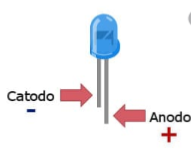
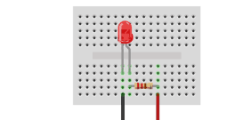
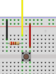
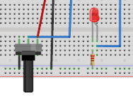

# Conexiones basicas de componentes
## Leds
La pestaña más larga, es la parte positiva y la pestaña más corta es la negativa.  
Siempre tendremos que usar una resistencia, que ira en la parte positiva.

  

Este es el esquema de conexion:

  

## Botones
Este es el esquema de conexion:

  

## Potenciometro
Este es el esquema de conexion:

  

