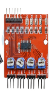
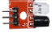

# Inflarrojos
Para hacer un seguidor de líneas el mínimo número de sensores que necesitaremos son 2. <br/>
El robot intentará mantener la línea entra ambos, oscilando continuamente.<br/>
Ademas es necesario usar la placa para conectar varios sensores de infrarrojos a la vez.

**Metodos** <br>
```CPP
  // Inicializacion del componente 
  void init();

  bool nivelAlto();
  bool nivelBajo();

```

## El sensor
En este sensor no es necesario una fuente extra de alimentacion 
<div style="display: flex; align-items: center; margin-bottom: 20px;">
  
  <p>Las entradas del controlador son:<br/>
  **VCC** = Se conecta al pin de 3v o 5v<br/>
  **GND** = Se conecta al pin de tierra<br/>
  **aut1** = Sensor 1<br/>
  **aut2** = Sensor 2<br/>
  **aut3** = Sensor 3<br/>
  **aut4** = Sensor 4
  </p>
</div>
<div style="display: flex; align-items: center; margin-bottom: 20px;">
  
  <p>Las entradas de los sensores son:<br/>
  **VCC** = Se conecta al pin de 3v o 5v<br/>
  **GND** = Se conecta al pin de tierra<br/>
  **out** = salida de datos 1<br/>
  </p>
</div>

## Ejemplos
Se puede ver un ejemplo en la carpeta ''examples/nivelAgua'', ademas esta con la informacion en pantalla.
