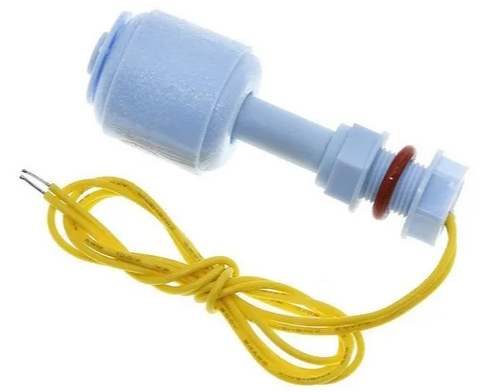

# Flotador
Componente que calcula el nivel de agua de un deposito

**Metodos** <br>
```CPP
  // Inicializacion del componente 
  void init();

  bool nivelAlto();
  bool nivelBajo();

```

## El sensor
En este sensor no es necesario una fuente extra de alimentacion 
<div style="display: flex; align-items: center; margin-bottom: 20px;">
  
  <p>Las entradas son:<br/>
  **Pin** = Se conecta a un pin de datos<br/>
  **GND** = Se conecta al pin de tierra<br/>
  </p>
</div>

## Ejemplos
Se puede ver un ejemplo en la carpeta ''examples/nivelAgua'', ademas esta con la informacion en pantalla.
