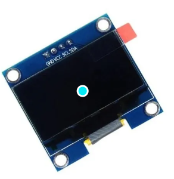

# Pantalla OLED

Vamos a tener que usar las librerias **Adafruit SSD1306** y **Adafruit GFX Library**

**Metodos** <br>
```CPP
  // Inicializacion del componente 
  void init(uint8_t SDA, uint8_t SCL);

  void escribeTexto(const String &texto);
  void escribeParrafo(const char *lineas[], uint8_t numLineas);

  void borrarPantalla();

  // Graficos
  void dibujaLinea(int x0, int y0, int x1, int y1);
  void dibujaRect(int x, int y, int w, int h, bool relleno = false);
  void dibujaCirculo(int x, int y, int r, bool relleno = false);
  void dibujaBarra(int valor, int maximo);
  void dibujaGrafico(const int datos[], uint8_t n);

```

## El sensor
En este sensor no es necesario una fuente extra de alimentacion 
<div style="display: flex; align-items: center; margin-bottom: 20px;">
  
  <p>Las entradas son:<br/>
  **VCC** = Se conecta al pin de 3v<br/>
  **GND** = Se conecta al pin de tierra<br/>
  **SCK** = Se conecta a un pin D (Reloj I2C)<br/>
  **SDA** = Se conecta a un pin D (Datos I2C)
  </p>
</div>

## Ejemplos
Se puede ver un ejemplo en la carpeta ''examples/pantalla''<br/>
