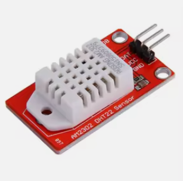

# Sensor DHT22
Es un sensor con el que se puede recuperar la temperatura y la humedad ambiente.<br>
Se tiene que usar la librería **dht.h** para realizar el cálculo de temperatura y humedad.<br>

**Metodos** <br>
```CPP
  // Inicializacion del componente 
  void init(uint8_t id);
  void init(uint8_t id, String nombre);

  // Metodo para poder modificar el nombre del dispositvo
  void setNombre(String nombre);

  // Recupera la informacion del sensor
  TempAndHumidity leer();
  float getTemperatura();
  float getHumedad();

  // Mustra la informacion en la consola
  void toConsole(TempAndHumidity data);
  // Genera un fichero html para mostrar la informacion
  String toHtmlContent(TempAndHumidity data);

```

## El sensor
En este sensor no es necesario una fuente extra de alimentacion 
<div style="display: flex; align-items: center; margin-bottom: 20px;">
  
  <p>Las entradas son:<br/>
  **DAT** = Salida de datos del control, se conecta a uno de lso pines Dx<br/>
  **VCC** = Se conecta al pin de 3v o 5v<br/>
  **GND** = Se conecta al pin de tierra
  </p>
</div>

## Ejemplos
Se puede ver un ejemplo en la carpeta ''examples/sensores''
