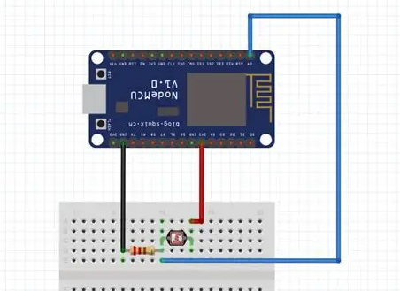

# Sensor LDR
Con este sensor podemo ver la canditad de luz que tenemos. </br>


**Metodos** <br>
```CPP
  // Inicializacion del componente 
  void init(uint8_t id);
  void init(uint8_t id, String nombre);

  // Podemos configurar las resistencias
  void modificarResistencias(long ra, int rb, int rc);

  // Nos indica la lectura del sensor
  int lecturaNormal();
  // Nos indica los valores de luz parametrizado
  int lecturaNivelLuz(int nivel);
  
  // Mustra la informacion en la consola
  void toConsole(int intensidad);
  // Genera un fichero html para mostrar la informacion
  String toHtmlContent(int intensidad);

```

**Valores de calibracion definidos por constantes** <br>
| Constante | Valor | Definicion |
|----------|-----------|-----------|
| Resistencia A  | 1000 KΩ   | Resistencia en oscuridad   |
| Resistencia B  | 15 KΩ  | Resistencia a la luz (10 Lux)   |
| Resistencia Rc  | 10 KΩ   | Resistencia calibracion   |

En esta [pagina](https://www.luisllamas.es/medir-nivel-luz-con-arduino-y-fotoresistencia-ldr/) se puede comprapbar mejor como funcionan las resistencias y que valores se deberian realizar.

## El sensor
En este sensor no es necesario una fuente extra de alimentacion, pero si que es necesario que se ponga una resistencia para el correcto funcionamiento.<br>
<span style="background-color: grey;">**!Importante:** En este caso la conexion es a un pin analógico</span><br>

<br>
Este es el esquema que tendriamos que usar: <br>
<br>

## Ejemplos
Se puede ver un ejemplo en la carpeta ''examples/sensores''
