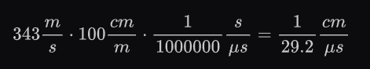
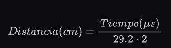
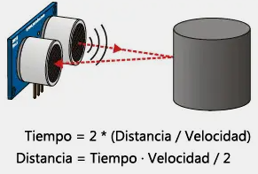
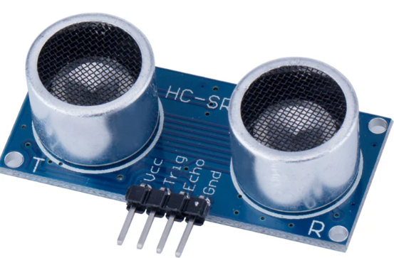

# Sensor HC-SR04
Un sensor de ultrasonidos es un dispositivo para medir distancias.   
El rango de medición teórico del sensor HC-SR04 es de 2cm a 400 cm, con una resolución de 0.3cm. Y tiene un grado de inclinacion de 15º. 
Se tiene que usar la librería **[NewPing](https://bitbucket.org/teckel12/arduino-new-ping/wiki/Home)** para facilitar el desarrollo del codigo. 

El sensor se basa simplemente en medir el tiempo entre el envío y la recepción de un pulso sonoro. Sabemos que la velocidad del sonido es 343 m/s en condiciones de temperatura 20 ºC, 50% de humedad, presión atmosférica a nivel del mar. Transformando unidades resulta

  

Es decir, el sonido tarda 29,2 microsegundos en recorrer un centímetro. Por tanto, podemos obtener la distancia a partir del tiempo entre la emisión y recepción del pulso mediante la siguiente ecuación.

  

El motivo de dividir por dos el tiempo (además de la velocidad del sonido en las unidades apropiadas, que hemos calculado antes) es porque hemos medido el tiempo que tarda el pulso en ir y volver, por lo que la distancia recorrida por el pulso es el doble de la que queremos medir.

  

Para mas informacion se puede ver esta [pagina](https://www.luisllamas.es/medir-distancia-con-arduino-y-sensor-de-ultrasonidos-hc-sr04/) donde se indica como se puede hacer sin libreria.

## El sensor
Este sensor necesita una fuente o que el dispositivo donde este conectado le pueda proporcionar 5v

  
  
Las entradas son: 
    **VCC** = Se conecta al pin de 3v o 5v 
    **GND** = Se conecta al pin de tierra 
    **trig** = Pin de entrada del disparador 
    **echo** = Pin de salida de eco
  

## Ejemplos
Se puede ver un ejemplo en la carpeta ''examples/sensorHCSR04'' 
Si no se esta viendo al informacion en la consola esta tiene que estar a 9600 baudios.